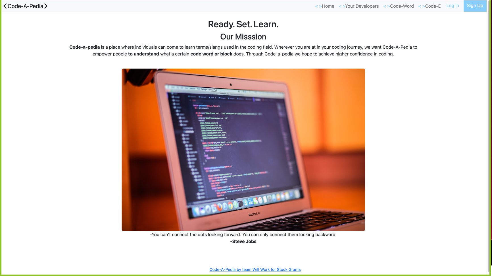
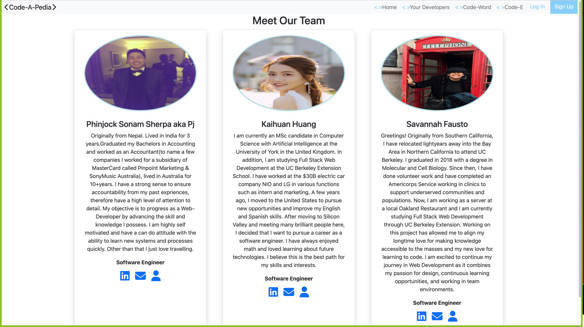
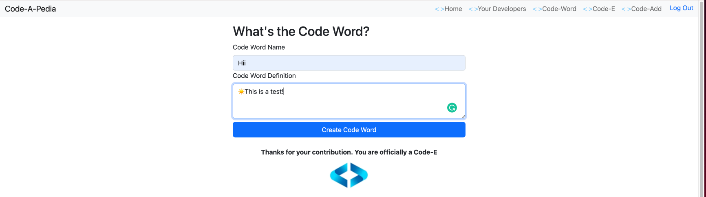
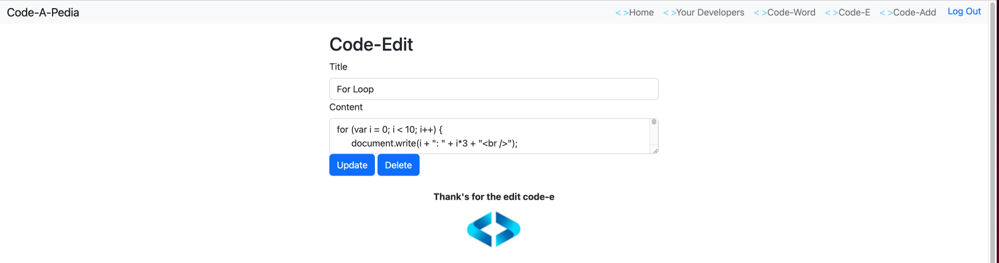
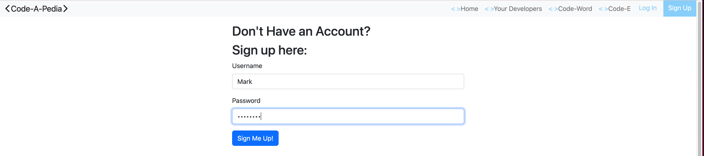

# Code-a-pedia 
  [
      ](https://opensource.org/licenses/mit)
  

  ## Table of Contents
* [Project Description](#Project-Description)
* [Assets](#assets)
* [Installation](#installation)
* [Deployment](#Deployment)
* [Screenshots](#Screenshots)
* [Technologies](#technologies)


## Project Description:
`
Code-a-pedia's purpose is to help individuals to understand terms/slangs used in the field. This can help people going through imposter syndrome or people who want to know what a certain coding term does, basically giving a basic of something code related in a defintion so it is easy to read through and get your confidence on that term.
`

User Story:
Our users are students/jobseekers/professionals in coding related background. This is a knowledge bank just for coding        terms/definitions/slangs. This allows the individuals to understand/recall information talked about during lecture/interview/workspace.
      
Acceptance Criteria:
      GIVEN a Navbar with Navbar-items Home/Your Developer and option to sign in or sign up.

      WHEN I click on Your Developer

      A brief information is provided about Your Developer who created Code-pedia.
      WHEN I click on Sign up.
      
      THEN a template appears a template appears to input information.
      
      WHEN I click on Sign in after registration.
      
      THEN a form input appears for username and password. If wrong password or username from registration, webpage will not proceed               forward. Once username and password registered is used then will have access to webpage.
      
      WHEN Signed in. 
       
      THEN a Navbar has added Navbar items,code-add and Signout.
         
      WHEN Navbar item clicked for code-word and code-e.
      
      THEN I am presented with various terms,definitions or codes. When clicked on code-e the same definitions has an edit button. When           clicked shows another template to edit or delete the term/code.
      
      WHEN I click on code-add.
      
      THEN I'am presented with a new page to write Code Word Name and definition.
      
      WHEN I click on signout.
      
      THEN I am presented with home page.


## Installation 
The user should clone the repository from GitHub and download Node. 
Run `npm i ` to install.
Run `npm run seed ` to run the database.
Run `npm start ` to start the Code-a-pedia .


## Deployment:
- Deployed link: https://github.com/pjsherpa/Code-a-pedia
- Heroku link: https://codeapedia.herokuapp.com/

## Screenshots
The following images demonstrate the web application's appearance and functionality:








## Technologies used
- [Javascript](https://www.w3schools.com/jsref/default.asp)
- [Node.js](https://nodejs.org/en/)
- [mySQL](https://www.mysql.com/)
- [JSON](https://www.json.org/json-en.html)
- [dotenv](https://www.npmjs.com/package/dotenv)
- [MySQL2](https://www.npmjs.com/package/mysql2)
- [InsomniaCore](https://insomnia.rest/products/insomnia)
- [Handlebars.js](https://handlebarsjs.com/)
- [Heroku](https://heroku.com/)
- [Express.js](https://expressjs.com/)
- [Sequelize](https://sequelize.org/)


## Made by 
```
Phinjock Sherpa
Kaihuan Huang
Savannah Fausto

```
